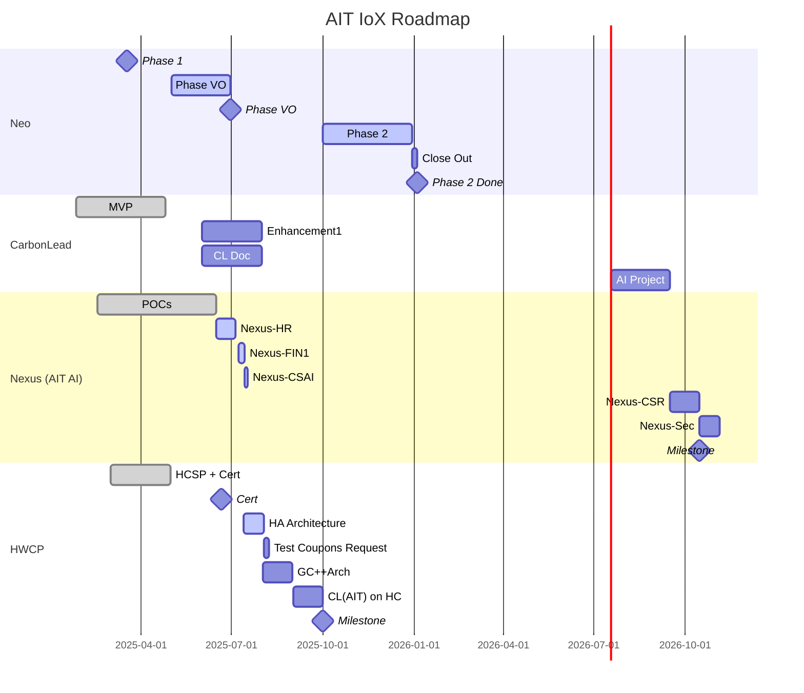

```mermaid
gantt
    title AIT IoX Roadmap
    dateFormat  YYYY-MM-DD
    
    section Neo 
        Phase 1       : milestone, neom0, 2025-03-17, 0d
        Phase VO      : active,neo2, 2025-05-01, 60d
        Phase VO      : milestone, neom1, after neo2, 0d
        Phase 2       : active,neo3, 2025-10-01, 90d
        Close Out     : neo4,after neo3, 5d
        Phase 2 Done  : milestone, neom2, after neo4, 0d

    section CarbonLead 
        MVP          : done,cl1,2025-01-25, 90d
        Enhancement1 : active cl2, 2025-06-01, 60d
        CL Doc       : active cl3, 2025-06-01, 60d
        AI Project   : cl4,after 2025-08-01, 60d

    section Nexus (AIT AI)
        POCs        : done,a1, 2025-02-15, 120d
        Nexus-HR    : active,a2, 2025-06-15, 20d
        Nexus-FIN1  : active,a3, 2025-07-8, 6d
        Nexus-CSAI  : active,a4, 2025-07-14, 3d
        Nexus-CSR   : a5, after cl4, 30d
        Nexus-Sec   : a6, after a5, 20d
        Milestone   : milestone, am1, after a5, 0d

    section HWCP 
        HCSP + Cert : done,h1, 2025-03-01, 60d
        Cert        : milestone,hm1, 2025-06-20, 0d
        HA Architecture : active, h2, 2025-07-13, 20d
        Test Coupons Request: h3, after h2, 5d
        GC++Arch :  h4,2025-08-01,30d
        CL(AIT) on HC :  h5,2025-09-01,30d
        Milestone   : milestone, hm2, after h5, 0d
```